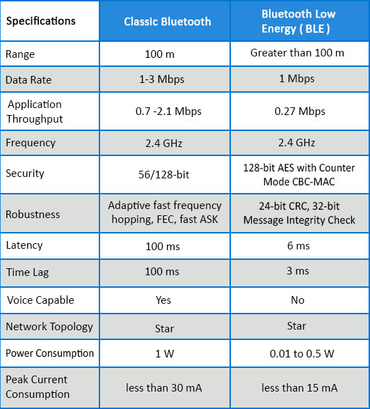
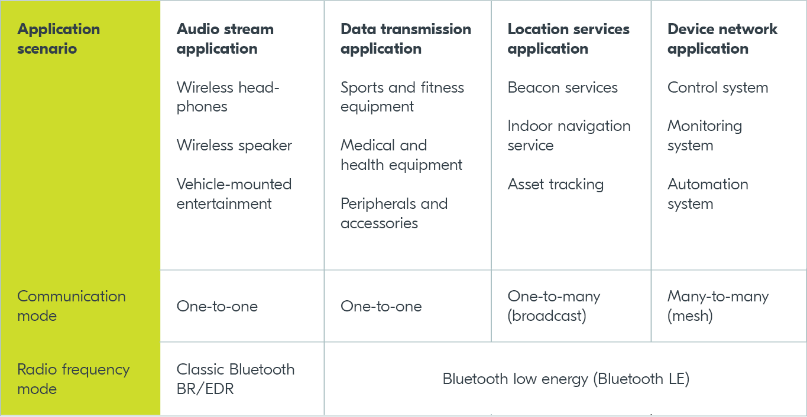
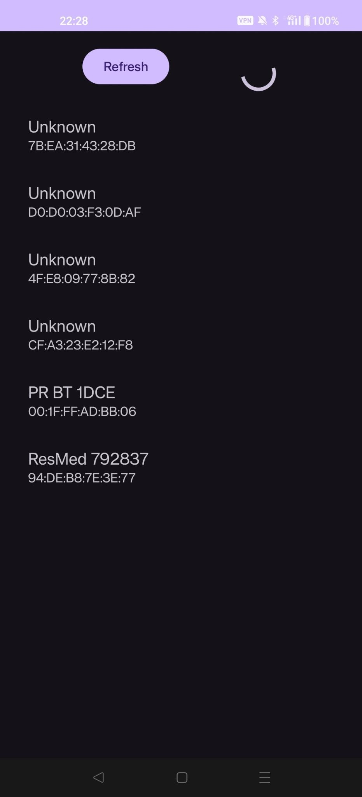

# Travail théorique sur le Bluetooth Low Energy


**Auteurs:** Timothée Van Hove, Léo Zmoos

**Date:** 15.01.2024


## Introduction

L’objectif de ce travail consiste à étudier le Bluetooth Low Energy dans l’écosystème Android, la présentant en mettant en avant les fonctionnalité, comment est-ce qu’elle s’utilise et points d’attention à connaître. 


## Historique
Au départ, le SIG a fait la promotion de Bluetooth LE en l'appelant "Bluetooth Smart" pour le distinguer de la version classique, qui utilisait le terme autonome "Bluetooth". L'expression "Bluetooth Smart ready" a également été utilisée pour représenter le Bluetooth bimode qui prendrait en charge les deux variantes.

Cette technologie représente une avancée dans le domaine des technologies de transmission sans fil car il est conçu spécifiquement pour répondre aux applications wireless nécessitant une faible consommation d'énergie. Par exemple, les capteurs, les montres connectées, les dispositifs médicaux ou les systèmes de domotique.

Le Bluetooth Low Energy est capable d'établir une communication entre appareils tout en minimisant l'impact sur leur consommation. Cet avantage le rend adapté à dans les dispositifs IoT, où la gestion énergétique est très importante.


## Concepts de base

La norme Bluetooth 4.1 - 5.2 publiée par SIG comprend à la fois Bluetooth Low Energy et Bluetooth classique. Lorsque vous développez des applications Bluetooth, vous devez donc savoir clairement quelle version utiliser, car elles fonctionnent différemment.

### GATT (Generic Attribute Profile)

Le GATT (Generic Attribute Profile) est l'un des piliers fondamentaux du Bluetooth Low Energy (BLE) car il permet de définir la manière dont les dispositifs communiquent et échangent des données. Le GATT repose sur un modèle client-serveur.

Le client est un périphérique qui initie et contrôle les connexions avec le serveur. (Ex. smartphone), tandis que le serveur contient des données regroupées sous le nom de `services`. Chaque service contient des caractéristiques qui sont les informations pouvant être échangées.

## Services

Les services sont des conteneurs qui regroupent des données et fonctions liées entre elle (voir exemple ci-dessous) sur un appareil Bluetooth. 

Par exemple:

> Pour un dispositif de suivi d'activité physique. Il y aurait un service dédié à la surveillance du rythme cardiaque.


Ils aident donc à organiser les données et fonctions de manière ordonnée.  Chaque conteneur possède un UUID (Identifiant Universel Unique) et peut contenir une ou plusieurs  caractéristiques à l'intérieur.

### Caractéristiques

Les caractéristiques représentent les données échangeables au sein d'un service.

#### Propriétés:
- Associée à un type de données spécifique(int, strings, etc.) 
- Possèdes son propre UUID. 

Les caractéristiques jouent un rôle crucial dans la définition des fonctionnalités offertes par un périphérique BLE.


### Modes de fonctionnement du BLE
#### Mode Central

Dans le mode central, un dispositif joue le rôle de "centrale" et s'occupe d'initier la connexion avec un ou plusieurs périphériques. 


> Généralement, ce sont des dispositifs tels que les smartphones/tablettes ou ordinateurs qui utiliseront ce mode.

Ces derniers contrôlent et collectent des données à partir de périphériques BLE.


#### Mode Périphérique

Le mode périphérique correspond au rôle des dispositifs qui se rendent disponibles pour la connexion. Ces dispositifs émettent des données ou fournissent des services à d'autres dispositifs BLE en mode ***central***. Les périphériques BLE sont par exemple:

- des capteurs
- des objets portables
- Autres appareils émettant des données à des fins spécifiques.


Ensemble, ces deux modes permettent des interactions flexibles entre les dispositifs BLE.


## BLE vs Bluetooth classic

Le Bluetooth Low Energy (BLE) et le Bluetooth classique représentent deux évolutions distinctes de la technologie sans fil Bluetooth, chacune adaptée à des besoins spécifiques. Nous allons donc comparer ces deux technologies sur quelques points pertinents:

### Consommation d'énergie:

L'une des comparaisons majeures que l'on peut faire entre ces deux technologie est évidemment dans l'utilisation de l'énergie. Comme vu auparavant, le BLE est conçu pour limiter au maximum la consommation énergétique. C'est donc pour ça qu'il est autant adapté à l'IOT. A contrario, le bluetooth classique permettra d'effectuer d'autres actions qui nécessiterons plus d'énergie.

 
<p align="center">
  
</p>


[source](https://iotlab.tertiumcloud.com/2020/08/19/classic-bluetooth-vs-bluetooth-low-energy-ble/)


### Applications:
Comme vu auparavant, les applications de ces technologie sont donc bien différentes.

<p align="center">
  
</p>

[source](https://blog.nordicsemi.com/getconnected/the-difference-between-classic-bluetooth-and-bluetooth-low-energy)

En conclusion, il n'y en un pas un qui serait "mieux" que l'autre, ils ont juste un objectif différent!


## Implémentation dans Android

L'implémentation d'une communication BLE dans Android est complexe. Elle nécessite plusieurs étapes:

1. La gestion des permissions
2. La détection du device
3. la connexion au device (GATT server)
4. Le transfert de données entre les devices

Nous vous proposons une application de démo sur notre [repo Github](https://github.com/DrC0okie/HEIG_DAA_Workshop), qui implémente uniquement la détection de devices BLE et la gestion des permissions. L'implémentation des 2 autres fonctionnalités nécessiterait plus de temps dans le cadre de ce travail.


<p align="center">
  
</p>


### Permissions Bluetooth

Les applications utilisant le Bluetooth doivent déclarer des permissions spécifiques dans le manifest de l'application, avec des exigences variant selon la version cible du SDK Android.

#### Pour Android 12 ou supérieur

- Utiliser la permission `BLUETOOTH_SCAN` pour rechercher des appareils Bluetooth, comme les périphériques BLE.
- Utiliser la permission `BLUETOOTH_ADVERTISE` si l'application rend l'appareil courant découvrable par d'autres devices Bluetooth.
- Utiliser la permission `BLUETOOTH_CONNECT` pour communiquer avec des appareils Bluetooth déjà appairés.
- Déclarer `ACCESS_FINE_LOCATION` si l'application utilise les résultats de la recherche Bluetooth pour déterminer la position physique.
- Les permissions `BLUETOOTH_ADVERTISE`, `BLUETOOTH_CONNECT` et `BLUETOOTH_SCAN` sont des permissions d'exécution, nécessitant l'approbation de l'utilisateur.

#### Pour Android 11 ou inférieur

- Utiliser la permission `BLUETOOTH` pour toute communication via Bluetooth classique ou BLE.
- Déclarer `ACCESS_FINE_LOCATION` car une recherche Bluetooth pourrait potentiellement être utilisée pour recueillir des informations sur la localisation de l'utilisateur.

#### Découverte des appareils Bluetooth locaux

- Déclarer la permission `BLUETOOTH_ADMIN` pour permettre à l'application d'initier la découverte d'appareils ou de manipuler les paramètres Bluetooth.

### Spécification de l'utilisation des fonctionnalités Bluetooth

- Ajouter des indicateurs dans le manifest indiquant si le Bluetooth est une composante essentielle de l'application, en utilisant l'élément `<uses-feature>`. Par exemple: `android.hardware.bluetooth` pour le Bluetooth classique et `android.hardware.bluetooth_le` pour le BLE.
- Pour rendre l'application disponible sur des appareils ne supportant pas le Bluetooth classique ou le BLE, incure l'élément `<uses-feature>` dans le manifest avec `required="false"`. Ensuite, vérifier la disponibilité des fonctionnalités au runtime en utilisant `PackageManager.hasSystemFeature()`

#### Sommaire:

```xml
    <!--BLUETOOTH PERMISSIONS-->
    <!-- Request legacy Bluetooth permissions on older devices. -->
    <uses-permission android:name="android.permission.BLUETOOTH" />
    <uses-permission android:name="android.permission.BLUETOOTH_ADMIN" />

    <!-- Needed only if the app looks for Bluetooth devices.
             If the app doesn't use Bluetooth scan results to derive physical
             location information, we can strongly assert that the app
             doesn't derive physical location. -->
    <uses-permission android:name="android.permission.BLUETOOTH_SCAN" />

    <!-- Needed only if the app makes the device discoverable to Bluetooth devices. -->
    <uses-permission android:name="android.permission.BLUETOOTH_ADVERTISE" />

    <!-- Needed only if the app communicates with already-paired Bluetooth devices. -->
    <uses-permission android:name="android.permission.BLUETOOTH_CONNECT" />

    <!--hardware option: required="false" if we check it on runtime-->
    <uses-feature android:name="android.hardware.bluetooth_le" android:required="false"/>
```


### Recherche des appareils BLE ([doc](https://developer.android.com/develop/connectivity/bluetooth/ble/find-ble-devices))

Pour trouver des appareils BLE, il faut utiliser la méthode startScan(). Cette méthode prend un ScanCallback en paramètre. Il faut  implémenter ce callback, car c'est ainsi que les résultats du scan sont renvoyés. Le scan est gourmand en batterie, il faut respecter les bonnes pratiques suivantes :

* Dans le cas où on cherche un device précis, dès que nous l'avons trouvé, arrêter le scan.
* Dans le cas où nous ne connaissons pas l'appareil à connecter, il ne faut jamais faire un scan en boucle. Toujours fixer une limite de temps au scan. 
* Un appareil qui était disponible auparavant peut s'être déplacé hors de portée, et le fait de continuer à scanner épuise la batterie.

Pour rechercher uniquement certains types de périphériques, on peut appeler `startScan(List<ScanFilter>, ScanSettings, ScanCallback)`, en fournissant une liste d'objets `ScanFilter` qui limitent les périphériques recherchés par l'analyse et un objet `ScanSettings` qui spécifie les paramètres de l'analyse.

Dans l'exemple suivant, l'application BLE fournit une activité pour rechercher les appareils Bluetooth LE disponibles et les afficher dans une RecyclerView. Ce exemple comprend la vérification des permissions au runtime:

```kotlin
class MainActivity : AppCompatActivity() {
    private lateinit var recyclerView: RecyclerView
    private lateinit var adapter: LeDeviceListAdapter
    private lateinit var scanCallback: ScanCallback
    private lateinit var progressBar: ProgressBar
    private var devices = mutableListOf<BleDevice>()
    private val granted = PackageManager.PERMISSION_GRANTED
    private val accessLoc = android.Manifest.permission.ACCESS_FINE_LOCATION
    private val REQUEST_PERMISSIONS_CODE = 1

    // Get the bluetooth manager
    private val bluetoothAdapter: BluetoothAdapter? by lazy {
        val bluetoothManager = getSystemService(Context.BLUETOOTH_SERVICE) as BluetoothManager
        bluetoothManager.adapter
    }

    // Runtime checked permissions
    private val requiredPermissions = arrayOf(
        accessLoc,
        android.Manifest.permission.BLUETOOTH_SCAN,
        android.Manifest.permission.BLUETOOTH_CONNECT
    )

    private val bleScanner: BluetoothLeScanner?
        get() = bluetoothAdapter?.bluetoothLeScanner

    override fun onCreate(savedInstanceState: Bundle?) {
        super.onCreate(savedInstanceState)
        setContentView(R.layout.activity_main)

        // initialize the RecyclerView with the adapter and the progress bar
        recyclerView = findViewById(R.id.recycler_view)
        recyclerView.adapter = LeDeviceListAdapter(devices)
        recyclerView.layoutManager = LinearLayoutManager(this)
        progressBar = findViewById(R.id.progress_bar)
        
        // Click listener for the "Scan" button
        findViewById<Button>(R.id.button_refresh).setOnClickListener {
            devices.clear()
            adapter.notifyDataSetChanged()
            startBleScan()
        }
    }
}
```


La méthode `startBleScan` est utilisée pour démarrer le processus de scan des devices BLE à proximité. On commence par vérifier si toutes les permissions sont accordées. Ça inclut la permission d'accès à la localisation (`ACCESS_FINE_LOCATION`), qui est requise pour la détection des périphériques BLE. Si les permissions ne sont pas accordées, la méthode demande ces permissions à l'utilisateur. Si les permissions sont accordées, un `ScanCallback` est défini. Il contient plusieurs méthodes qui traitent les différents événements du processus de scan:

- `onScanResult` : Appelée à chaque fois qu'un périphérique BLE est détecté. Extrait les informations du périphérique (comme le nom et l'adresse) et met à jour l'adapter de la RecyclerView.
- `onBatchScanResults` : Utilisée pour gérer un groupe de résultats de scan disponibles en une seule fois, bien que dans notre cas, elle n'est pas implémentée.
- `onScanFailed` : Appelée en cas d'échec du processus de scan, permettant de gérer les erreurs.

Après la définition du callback, la méthode affiche une barre de progression pour indiquer à l'utilisateur que le scan est en cours, puis démarre le scan en appelant `startScan` sur l'objet `bleScanner`.

Finalement, un délai est défini pour arrêter le scan après 10 secondes, pour économiser la batterie et limiter les ressources utilisées, en utilisant `Handler().postDelayed` qui appelle la méthode `stopBleScan` après un délai de 10 secondes.

```kotlin
private fun startBleScan() {
    if (requiredPermissions.any { checkSelfPermission(it) != granted }) {
        // Request permissions, then start scan
        requestPermissions(requiredPermissions, REQUEST_PERMISSIONS_CODE)
    } else {
        // Permissions granted, define callback, then start scan
        val scanCallback = object : ScanCallback() {
            override fun onScanResult(callbackType: Int, result: ScanResult) {

                if (checkSelfPermission(accessLoc) != granted) {
                    // Handle the case where permission is not granted
                    return
                }

                val device = result.device
                val bleDevice = BleDevice(device.name ?: "Unknown", device.address)
                if (bleDevice !in devices) {
                    adapter.devices.add(bleDevice)
                    adapter.notifyItemInserted(adapter.devices.size - 1)
                }
            }
            // List of scan results that are previously scanned.
            override fun onBatchScanResults(results: MutableList<ScanResult>) {}
            
            // Handle scan failure
            override fun onScanFailed(errorCode: Int) {}
        }
        // Show progress bar
        progressBar.visibility = View.VISIBLE

        // Start the scan
        bleScanner?.startScan(scanCallback)

        // Stop the scan after 10 seconds
        Handler(Looper.getMainLooper()).postDelayed({ stopBleScan()}, 10000) // 10 seconds
    }
}
```


La méthode stopBleScan arrête simplement le scan en cours et fait disparaître la `ProgressBar`

```kotlin
private fun stopBleScan() {
    if (::scanCallback.isInitialized && checkSelfPermission(accessLoc) == granted) {
        bleScanner?.stopScan(scanCallback)
    }
    // Hide the ProgressBar
    progressBar.visibility = View.GONE
}
```


L'override de la méthode `onRequestPermissionsResult` est appelée après que l'utilisateur ait répondu à une demande de permission avec le code de la requête (`requestCode`), un tableau des permissions demandées (`permissions`) et un tableau des résultats (`grantResults`).

On commence par vérifier le `requestCode` pour s'assurer qu'il correspond au code de demande de permissions envoyé . Dans ce cas, `REQUEST_PERMISSIONS_CODE` est utilisé comme identifiant.

Les conditions suivantes sont vérifiées :

- `grantResults.isNotEmpty()` : S'assure que le tableau des résultats n'est pas vide.
- `grantResults[0] == granted` : Vérifie si la première permission demandée (typiquement `ACCESS_FINE_LOCATION` pour la détection BLE) a été accordée.

Si la permission a été accordée, la méthode `startBleScan` est appelée pour démarrer le scan. Si non, une gestion d'erreur peut être implémentée (pas dans notre cas).

```kotlin
override fun onRequestPermissionsResult(
    requestCode: Int,
    permissions: Array<out String>,
    grantResults: IntArray
) {
    super.onRequestPermissionsResult(requestCode, permissions, grantResults)
    when (requestCode) {
        REQUEST_PERMISSIONS_CODE -> {
            if (grantResults.isNotEmpty() && grantResults[0] == granted) {
                // Permission granted, start the scan
                startBleScan()
            } else {
                // Permission denied, handle the failure
            }
        }
    }
}
```


## Conclusion

La communication BLE dans Android nécessite une compréhension approfondie des interactions entre l'appareil et l'application, allant de la découverte initiale et la connexion à un appareil BLE, à la découverte des services et à la manipulation des caractéristiques pour une communication. L'implémentation n'est pas triviale à prendre en main et nécessite beaucoup de temps et de compréhension de la documentation officielle.


## Bibliographie:

* [Documentation Android](https://developer.android.com/develop/connectivity/bluetooth/ble/ble-overview)

* Nous avons utilisé Chat GPT pour générer la structure du rapport, ainsi que la correction de la syntaxe de certaines phrases.
